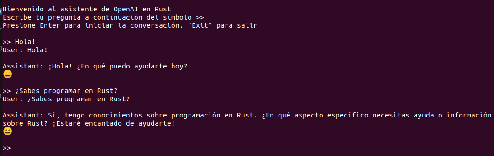

# Asistente sobre OpenAI en Rust

Este proyecto desarrolla un asistente que facilita la interacción con la API de OpenAI, implementado en el lenguaje de programación Rust. El objetivo es proporcionar una herramienta útil y eficiente para realizar solicitudes a la API de OpenAI, procesar las respuestas y explorar funcionalidades de inteligencia artificial.



## Estructura del Proyecto

El proyecto se compone de varios módulos clave:

- `main.rs`: El archivo principal que organiza el flujo de ejecución del programa, inicializando las configuraciones necesarias y coordinando las operaciones del asistente.
- `openai_api_data.rs`: Define las estructuras de datos y constantes necesarias para interactuar con la API de OpenAI, incluyendo modelos para las solicitudes y respuestas.
- `functions_ai.rs`: Implementa la lógica específica para la interacción con la API de OpenAI, procesando solicitudes y respuestas, y maneja funcionalidades de inteligencia artificial.
- `functions_other.rs`: Contiene funciones auxiliares y de utilidad general, como manejo de errores y funciones de ayuda para procesamiento de datos.

## Configuración y Ejecución

Para ejecutar este asistente, sigue estos pasos:

1. Asegúrate de tener Rust instalado en tu sistema. Si no lo tienes, puedes instalarlo siguiendo las instrucciones en [la página oficial de Rust](https://www.rust-lang.org/tools/install).

2. Clona este repositorio a tu sistema local.

3. Configura tu clave de API de OpenAI creando un archivo `.env` en el directorio raíz del proyecto. Dentro de este archivo, añade la siguiente línea, reemplazando `TU_API_KEY` con tu clave de API real de OpenAI:
    ```
    OPENAI_API_KEY=TU_API_KEY
    ```

4. En el directorio del proyecto, ejecuta el comando `cargo run` para iniciar el programa. Cargo se encargará de compilar el proyecto y ejecutar el asistente.

## Contribuciones

Las contribuciones son bienvenidas. Si tienes sugerencias para mejorar este asistente o quieres añadir nuevas funcionalidades, considera abrir un issue o una pull request en este repositorio.

## Licencia

Este proyecto se distribuye bajo la licencia MIT, lo que permite su uso, modificación y distribución libremente.